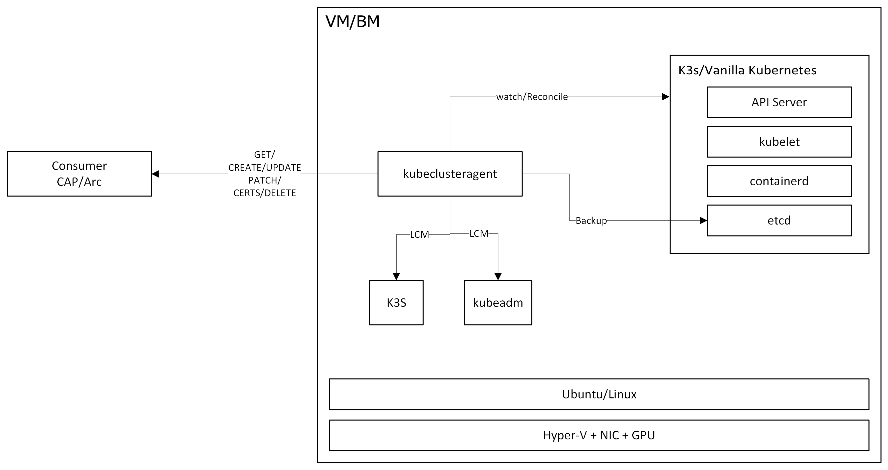
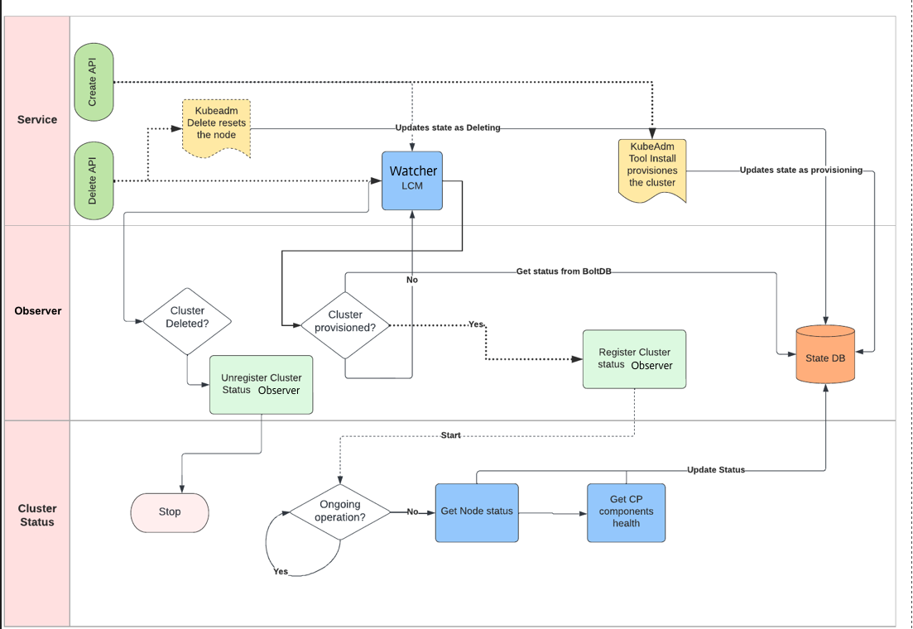

# kubeclusteragent 

## Authors
Debankur Chatterjee


# What is kubeclusteragent ?
kubeclusteragent  focuses on providing declarative APIs and tooling to simplify life cycle management of Single Node Kubernetes cluster.,kubeclusteragent API comprises `kubeclusteragent` , which runs on the server which essentially do the LCM of Single Node Kubernetes Cluster.
The `kubeclusteragent` is composed of a binary that provides a control plane for managing a single-node Kubernetes cluster on a VM. It includes lifecycle management and automation functions that eliminate the need to access the server through SSH.


## Design


## What is Single Node Kubernetes Cluster ?
To ensure the best outcome, it is desirable to have a distribution of Kubernetes that works well on a single VM. The Kubernetes instance should consume minimal resources while still providing the functionally expected from a Kubernetes cluster.
In some cases, like Telco RAN VMs, it is desirable to have a single node Kubernetes cluster that manages workloads that run on this VM. This allows the scheduling and managing of the lifecycle of workloads using the Kubernetes cluster while allowing the VM to retain the ability to operate with no dependencies. This provides resiliency to enable workloads to remain running even if the VM loses its network connection to the control plane.
A single-node Kubernetes cluster also simplifies upgrades from a micro-level view because there are no implicit dependencies on any other entities. At the macro level, there is a need for a control plane to handle larger coordination and orchestration, but the blast radius for a control plane failure does not include the VM itself.

# Kubernetes Distribution Currently Supported ? 
 - Kubeadm based Kubernetes Cluster (default)
 - k3s

# Create Cluster
To create a cluster, the consumer calls the Cluster Create API with a valid cluster resource object. The Agent performs the cluster installation. After the installation the cluster is available for use.
There are three phases of cluster installation. These are comprised of the pre-installation tasks, cluster installation tasks, and post-installation tasks. These tasks are run in order and status codes and outputs are evaluated to determine if installation can proceed. Status codes and outputs are captured to provide debugging aids in case of problems.
Tasks are idempotent and reversible. Multiple invocations must not change the state of the VM past the first run. Additionally, tasks are reversed when the cluster is removed.
To create a cluster, specification values are provided by the caller. At a minimum, the following values are required:

 -	Type of cluster (kubeadm, or other supported type)
 -	Cluster version
 -	Pod subnet CIDR range
 -  Service subnet CIDR rage
 -	Additional addresses to add the certificate SAN
 -	CNI details

# Managing the Cluster
After a cluster installed, the Agent provides management APIs for working with the cluster. The APIs provide the ability upgrade or remove the cluster and reset credentials. Additionally, these APIs allow for modification of the cluster itself.
The cluster can disable the ability to run. If this mode is activated, all workloads are stopped and no new workloads are started. This feature is useful when performing complex upgrades or as a measure to disable the server without removal.
The change API is invoked by patching the existing Cluster object. The patching mechanism is exposed using the HTTP PATCH verb.
Other values are updatable using the patch mechanism. At the minimum it is possible to do the following:

 -	Change the CNI version (only version change not CNI change is supported)
 -  Disable workload

# Cluster Upgrade
The Cluster change API allows the ability to upgrade the cluster to subsequent patch level in the cluster’s minor version or upgrades to a patch level in the next minor version (e.g., 1.23.2 -> 1.23.4 or 1.23.2 -> 1.24.1). 
The API does not allow for any other case and responds with an appropriate error. To upgrade beyond what’s provided, multiple upgrades are required. This is a limitation of Kubernetes’ built-in upgrade mechanism.  When a cluster is upgraded, deployed workloads are stopped and the tasks pertaining to the upgrade are performed. Once the upgrade completes successfully, the workloads are restarted unless the cluster is configured to disable workloads.

## Auto Cluster Upgrade
Cluster reconciliation framework as discussed below also have the ability to detect cluster upgrade if the underlying kubelet version is upgraded,in such situation cluster reconciliation framework will trigger in place upgrade.
during the upgrade process following things are restricted:
1. New App Scheduling
2. Updating the kubernetes Objects.


# Cluster Removal
The Cluster destroy API allows the ability to remove the cluster and its configuration from the VM. 
When removing the cluster, also remove its configuration files and change to system configuration.Agent relies on kubernetes cleanup 
which kubernetes is performing during cluster deletion.


# Reconcile and Watch framework
Framework provides implementation which enables the agent to react to change in upstream or downstream state by periodical executions.
1.	Cluster Status Watcher
      -	Monitors cluster state including node and control plane health.
      - If cluster is created/deleted/upgraded externally (not via Agent APIs), watcher has the intelligence to detect and update the agent state accordingly.

        
2. Cluster Certificate Reconclier - Cluster certs reconciler is a reconciliation engine inside kubeclusteragent which is responsible for state management of the cluster certs.


# Observability
It is possible to observe the agent and cluster in multiple ways. The agent’s logs are available through the systemd logging mechanism. Agent operations will be exposed by Audit API, in which entire LCM of the cluster will provided. Operational metrics are provided in Prometheus format. Metrics are provided for the agent itself and the high-level status of the cluster. Examples of types of metrics and audit to provide are in the appendix.
Details about the cluster are provided in the status object provided by the Cluster API. These details include if the cluster is installed or not, information about the installation or reset of a cluster if applicable, the current values for cluster version, CNI, and other installed components.
The Agent does not install a metrics server in the Kubernetes cluster since the ability to perform this task is provided by the cluster’s api-server after installation.

## Agent Metrics
The Agent provides metrics so that its status is ascertainable. The agent must provide the following metrics:
  - Memory (resident usage, virtual usage, garbage collector (if applicable), threads/goroutines)
  -	CPU (CPU usage total)
  - Other Resource usage (open file handles, API request statistics)
  -	Cluster (installed or not, last installation time)


## Agent Audit History
The Agent provides an API for audit history which details what operation has been performed on the agent e.g.create, upgrade patch and delete, 
and the status of the operation this is both human and machine-readable.


# Prerequisites
- Go 1.21
- [GoReleaser](https://goreleaser.com/install/)
- Buf

## Build
- Fetch repository from SCM
- Build binary: `goreleaser release --snapshot --rm-dist`

## Run
 - download `kubeclusteragent` binary to ubuntu/photon4 machine
 - provide chmod +x permission to the binary


# Cluster Manifest

```sh
# Example cluster resource
apiVersion: v1alpha1
kind: Cluster
spec:
  # The version of Kubernetes
  version: 1.24.11
  # The type of cluster. Initially, support for kubeadm
  # is provided, but this support is extendable to k3s,k0s
  clusterType: kubeadm
  # Disables the ability for the cluster to run workloads.
  disableWorkloads: false
  clusterParameters:
    apiServer:
      # Additional SANs to configure for the api-server's
      certSANs:
        - 34.66.72.135
    networking:
      # Subnet to use for pod networking
      podSubnet: 10.244.0.0/16
      # Subnet to use for service networking
      svcSubnet: 10.245.0.0/16
    cni:
      # The type of CNI to install. This is not changeable
      # once a cluster is installed.
      type: flannel
      # The version of the CNI to install. This is changeable
      # after the cluster is installed.
      version: 1.53.1
status:
  # machine readable description of the current status
  # possible values: not initialized, provisioning, provisioned,
  #   disabled, failed
  currentStatus: provisioned
  # human readble description of why the server has the
  # current status
  description: Cluster is installed and available
  # The current installed version of Kubernetes
  currentVersion: 1.23.0

```

# API
The API is generated using gRPC using protobuf definitions (proto/agent/v1alpha1/agent.proto).

```sh
## Create cluster

### Request

curl -X "POST" "https://example.com/api/v1alpha1/cluster" \
     -H 'Content-Type: text/plain; charset=utf-8' \
     -d $'{
              "apiVersion": "v1alpha1",
              "kind": "Cluster",
              "spec": {
                  "clusterType": "kubeadm",
                  "networking": {
                      "podSubnet": "100.100.0.0/16,2001:db8:1::/112",
                      "svcSubnet": "100.101.0.0/16,2001:db8:2::/112",
                      "clusterCni": {
                          "name": "calico",
                          "version": "v3.25.1"
                      }
                  },
                  "storage": {
                      "clusterCsi": {
                          "name": "local-path-storage",
                          "version": "v0.0.24"
                      }
                  },
                  "clusterRuntime": {
                      "customiseClusterRuntime": false,
                      "clusterCri": {
                          "privateRegistryEndpoints": [],
                          "privateRegistryFQDN": "example.com",
                          "skipTls": false,
                          "registryAuth": {
                              "isAuthRequired": true,
                              "username": "",
                              "password": ""
                          }
                      }
                  },
                  "apiServer": {},
                  "version": "v1.26.5",
                  "disableWorkloads": false
              }
          }'

### Response
{
    "apiVersion": "v1alpha1",
    "kind": "Cluster",
    "spec": {
                  "clusterType": "kubeadm",
                  "networking": {
                      "podSubnet": "100.100.0.0/16,2001:db8:1::/112",
                      "svcSubnet": "100.101.0.0/16,2001:db8:2::/112",
                      "clusterCni": {
                          "name": "calico",
                          "version": "v3.25.1"
                      }
                  },
                  "storage": {
                      "clusterCsi": {
                          "name": "local-path-storage",
                          "version": "v0.0.24"
                      }
                  },
                  "clusterRuntime": {
                      "customiseClusterRuntime": false,
                      "clusterCri": {
                          "privateRegistryEndpoints": [],
                          "privateRegistryFQDN": "",
                          "skipTls": false,
                          "registryAuth": {
                              "isAuthRequired": true,
                              "username": "",
                              "password": ""
                          }
                      }
                  },
                  "apiServer": {},
                  "version": "v1.26.5",
                  "disableWorkloads": false
              },
    "status": {
        "phase": "Provisioning",
        "conditions": [
            {
                "type": "ClusterReady",
                "status": "False"
            },
            {
                "type": "NodeReady",
                "status": "False"
            },
            {
                "type": "ControlPlaneReady",
                "status": "False"
            }
        ]
    }
}


```


```sh
## Upgrade cluster
curl -X "PUT" "https://example.com/api/v1alpha1/cluster" \
     -H 'Content-Type: text/plain; charset=utf-8' \
     -d $'{
  "apiVersion": "v1alpha1",
  "kind": "Cluster",
  "spec": {
   "clusterType": "kubeadm",
    "version": "1.23.0",
    "apiServer": {
      "certSANs": [
        "34.66.72.135"
      ]
    },
    "networking": {
      "podSubnet": "10.244.0.0/16"
    }
  }
}'
```

```sh
## Get cluster
curl "https://example.com/api/v1alpha1/cluster" \
     -H 'Accept: application/json'
     
### Response

{
    "apiVersion": "v1alpha1",
    "kind": "Cluster",
    "spec": {
        "clusterType": "kubeadm",
        "networking": {
            "podSubnet": "10.244.0.0/16",
            "cniManifestURL": "https://github.com/antrea-io/antrea/releases/download/v1.5.3/antrea.yml"
        },
        "apiServer": {
            "certSANs": [
                "34.66.72.135"
            ]
        },
        "version": "1.23.0",
        "disableWorkloads": false,
    },
    "status": {
        "kubernetesVersion": "v1.23.0",
        "phase": "Provisioned",
        "conditions": [
            {
                "type": "ClusterReady",
                "status": "True",
                "lastTransitionTime": "2022-07-25T13:46:20.639617726Z"
            },
            {
                "type": "ControlPlaneReady",
                "status": "True",
                "lastTransitionTime": "2022-07-25T13:46:20.639615531Z"
            },
            {
                "type": "NodeReady",
                "status": "True",
                "lastTransitionTime": "2022-07-25T13:46:20.626214111Z"
            }
        ]
    }
}

```

```sh
## Delete cluster
curl -X "DELETE" "https://example.com/api/v1alpha1/cluster"
```

```sh
## Get kubeconfig
curl "https://example.com/api/v1alpha1/kubeconfig"
```

```sh
## Reset Certs
curl -X "DELETE" "https://example.com/api/v1alpha1/certs"
```

```sh
## Metrics
curl -X "GET" "https://example.com:9443/metrics"
```

```sh
## Audit
curl -X "GET" "https://example.com/api/v1alpha1/cluster/audit"
```

